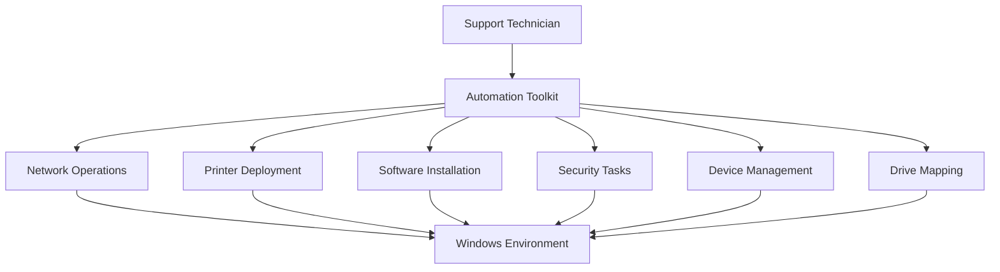

# 🚀 IT Support Automation Toolkit

> Enterprise-focused toolkit designed to automate routine IT support tasks, standardize operational procedures, and increase productivity across distributed environments.


---

## 📖 Overview

The **IT Support Automation Toolkit** was developed to simplify and accelerate common IT support and infrastructure operations.

The toolkit provides a centralized menu-driven interface that enables support technicians to perform administrative tasks with minimal manual intervention, reducing operational time and ensuring standardized procedures.

---

## 🎯 Objectives

- Reduce repetitive administrative tasks
- Standardize IT support procedures
- Accelerate incident resolution
- Improve operational efficiency
- Minimize manual errors
- Simplify onboarding of support technicians

---

## ⚙️ Features

### 🌐 Network Troubleshooting

- DHCP lease renewal
- DNS cache cleanup
- Network connectivity refresh

### 💻 Computer Management

- Computer renaming
- Automated reboot after rename
- System information display

### 🖨️ Printer Deployment

- Automated printer installation
- Location-based printer mapping
- Centralized printer deployment

### 🛠 Administrative Tools

- Device Manager launch
- Computer Management launch
- Local user administration

### 📦 Software Deployment

Automated installation of approved software packages:

- 7-Zip
- Notepad++
- Zscaler
- Lightshot
- Autodesk Tools
- Bizagi
- Vendor-specific utilities

### 📁 Network Drive Mapping

- Branch-specific network mappings
- Automated execution of corporate mapping scripts

### 🛡 Security Operations

- Windows Defender signature update
- Full malware scan execution

---

## 🏗 Architecture



---

## 📋 Main Menu

```text
1. Network Renewal
2. Rename Computer
3. Printer Installation
4. Device Manager
5. Computer Management
6. Software Installation
7. Network Drive Mapping
8. Malware Scan
```

---

## 💡 Business Value

This toolkit helps organizations:

- Reduce support handling times
- Standardize operational processes
- Improve technician productivity
- Decrease manual intervention
- Increase service consistency

---

## 🛠 Technologies

- Batch Script
- PowerShell
- Windows Server
- Active Directory
- Windows Defender
- SMB Shares
- Printer Management

---

## 📸 Screenshots

### Main Menu

assets/menu.png

### Software Deployment

assets/software.png

### Printer Installation

assets/printers.png

---

## 🚀 Future Improvements

- [ ] Full PowerShell migration
- [ ] Logging system
- [ ] Email notifications
- [ ] Microsoft Teams integration
- [ ] HTML reporting
- [ ] Automated asset inventory
- [ ] Entra ID integration
- [ ] Remote execution support

---

## 📄 License

This project is provided for educational purposes and as a demonstration of enterprise IT support automation practices.
`
